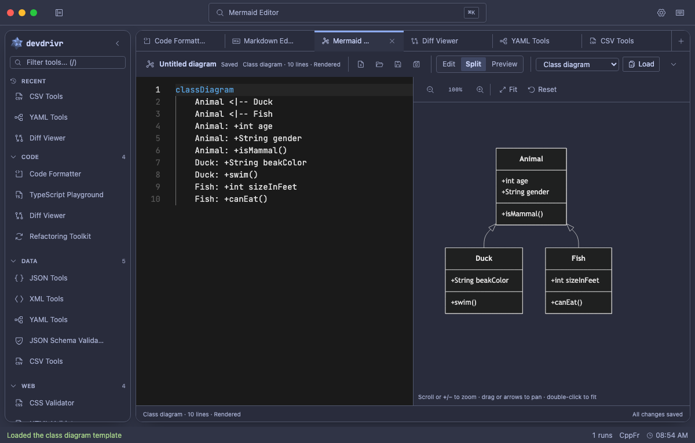
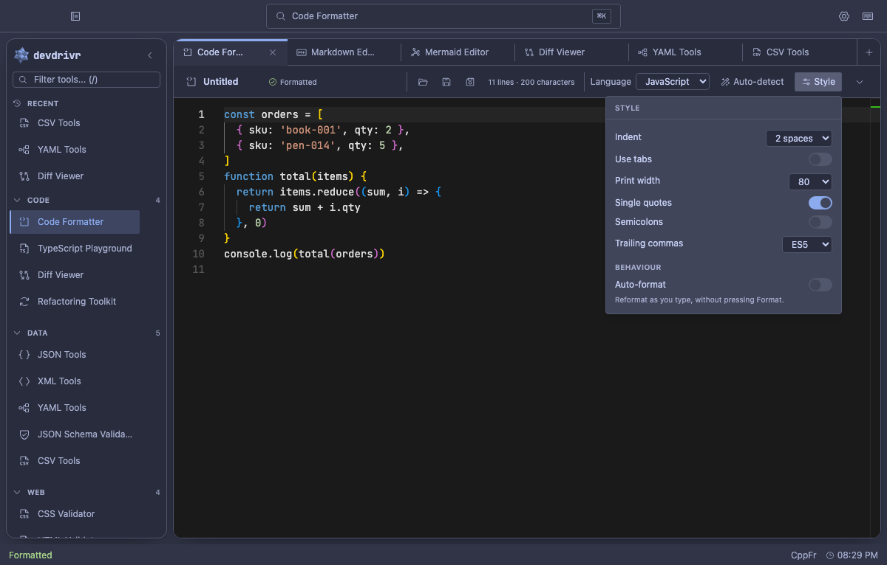
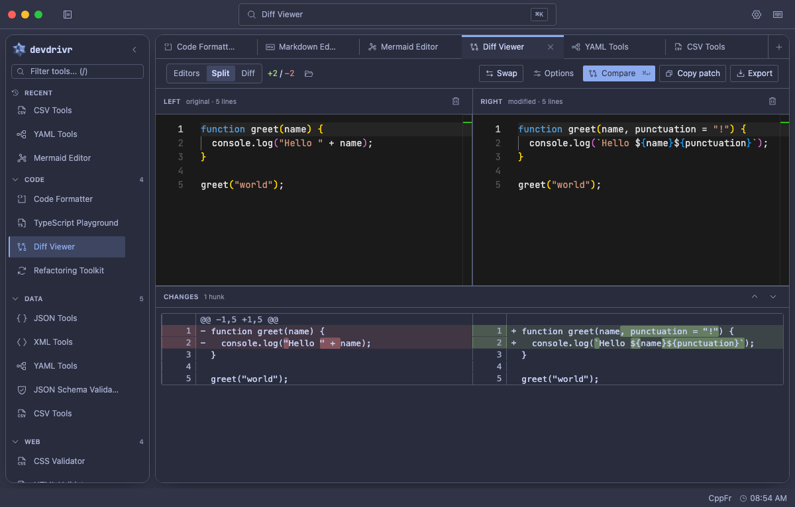
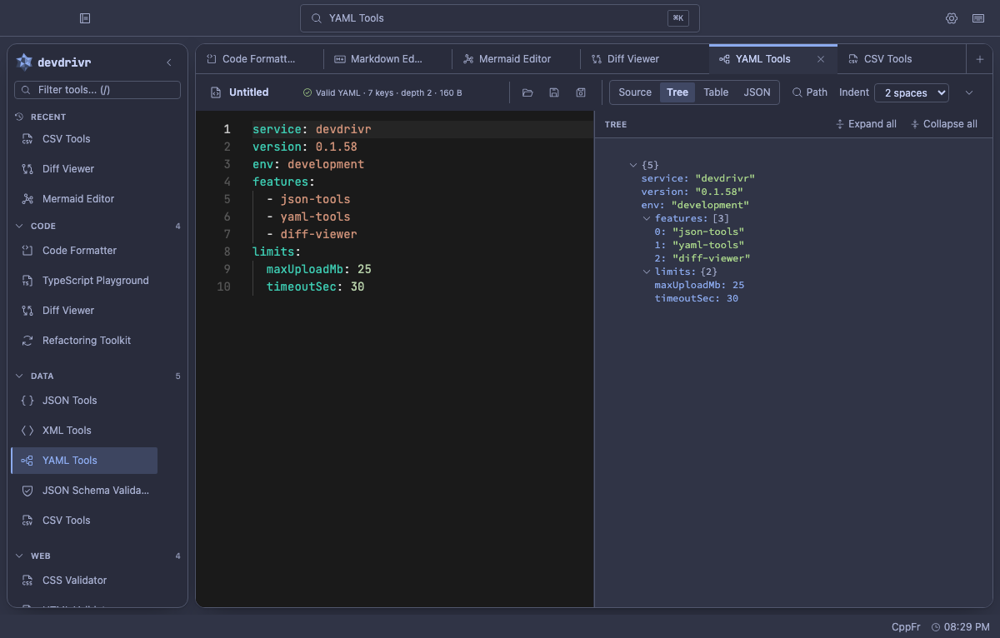
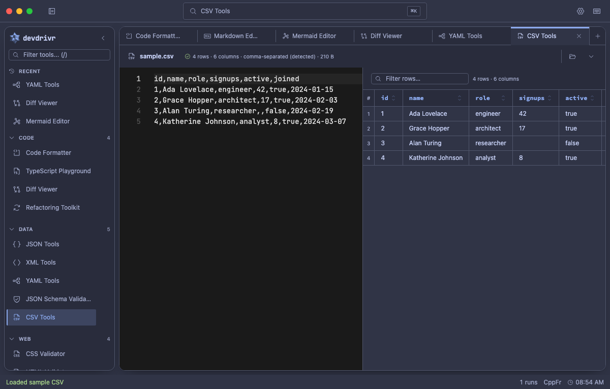
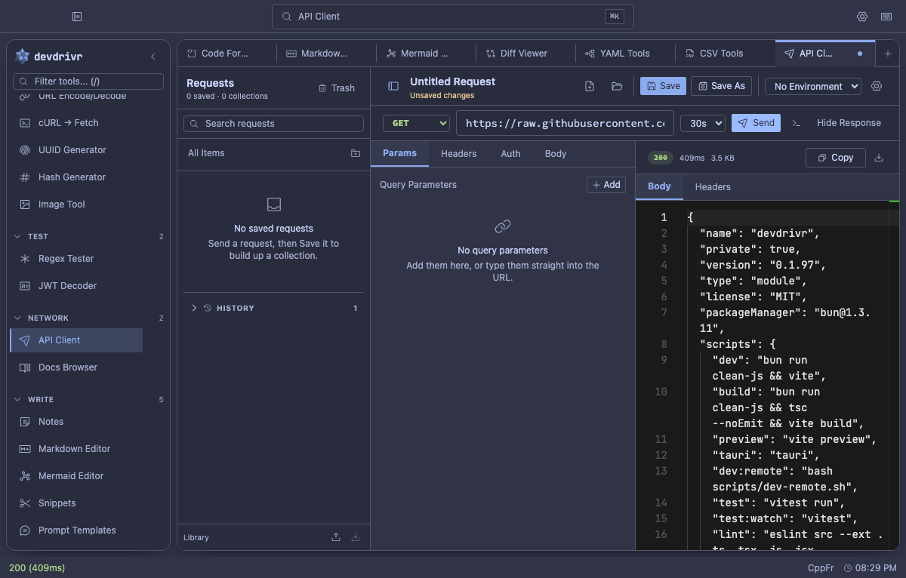
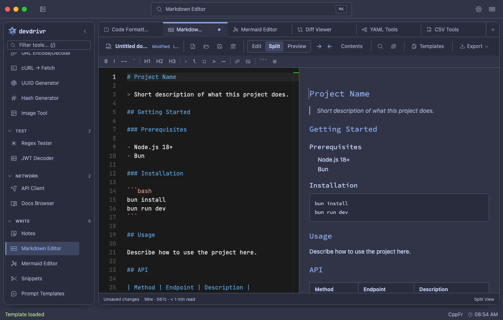

<div align="center">

# devdrivr

**A local-first, keyboard-driven developer workspace.**
**30 developer tools. One desktop app. No browser, no cloud, no latency.**

[](https://github.com/butteredstardust/devdrivr/releases/latest)
[](https://github.com/butteredstardust/devdrivr/actions/workflows/ci.yml)
[](LICENSE)
[](https://github.com/butteredstardust/devdrivr/releases/latest)

<br>



</div>

---

## Install

Grab the installer for your platform from the [latest release](https://github.com/butteredstardust/devdrivr/releases/latest):

| Platform              | Asset                               |
| --------------------- | ----------------------------------- |
| macOS (Apple Silicon) | `devdrivr_<version>_aarch64.dmg`    |
| Windows 10+           | `devdrivr_<version>_x64-setup.exe`  |
| Linux x64             | `devdrivr_<version>_amd64.AppImage` |

The builds are **unsigned**, so macOS Gatekeeper and Windows SmartScreen will both object the first
time you open one. [Getting past that](#unsigned-builds) takes about ten seconds and is documented at
the end of this file.

> [!NOTE]
> Intel macOS is not supported as of 0.1.83. `0.1.82` is the last release with an `x64.dmg`.

---

## Tools

Everything you reach for during a coding session — in one keyboard-driven app. Everything runs on
your machine: no accounts, no telemetry, no internet required.

| Group       | Tools                                                                                                                                   |
| ----------- | --------------------------------------------------------------------------------------------------------------------------------------- |
| **Code**    | Code Formatter · TypeScript Playground · Diff Viewer · Refactoring Toolkit                                                              |
| **Data**    | JSON Tools · XML Tools · YAML Tools · JSON Schema Validator · CSV Tools                                                                 |
| **Web**     | CSS Validator · HTML Validator · CSS Specificity · CSS → Tailwind                                                                       |
| **Convert** | Case Converter · Color Converter · Timestamp Converter · Base64 · URL Encode/Decode · cURL → Fetch · UUID Generator · Hash · Image Tool |
| **Test**    | Regex Tester · JWT Decoder                                                                                                              |
| **Network** | API Client · Docs Browser                                                                                                               |
| **Write**   | Markdown Editor · Mermaid Editor · Snippets Manager · Prompt Templates                                                                  |

### Shell features

- **Command palette** — fuzzy search every tool (`Cmd+K`)
- **Notes drawer** — persistent notes with color tags and full-text search
- **Per-tool history** — inputs and outputs are saved automatically
- **Snippets library** — tagged code snippets accessible from any tool
- **MCP server** — local agent access for notes, snippets, prompt templates, and saved API requests
- **Themes** — system mode plus 31 built-in themes
- **Always-on-top** — pin the window over your editor or browser
- **Window state persistence** — remembers size and position across launches
- **Auto-updater** — checks GitHub releases, then installs and restarts on your say-so

---

## Screenshots



**Format** — Prettier-backed formatting, with indent, quote, semicolon, and trailing-comma controls
in a popover that floats over your code instead of pushing it around.



**Compare** — Side-by-side and unified diffs, whitespace and case folding, patches you can copy or save.



**Data** — Inspect, validate, format, and convert structured data side by side.



**Tabular** — Read CSV as a sortable table, convert it to JSON, or validate it against a schema.



**Network** — Send requests and read responses, with a saved request library, environments, and
authentication a panel away.



**Write** — Work with Markdown, Mermaid diagrams, snippets, notes, and reusable prompts.

---

## Keyboard shortcuts

| Shortcut      | Action                       |
| ------------- | ---------------------------- |
| `Cmd+K`       | Command palette              |
| `Cmd+B`       | Toggle sidebar               |
| `Cmd+]` / `[` | Next / previous tool         |
| `Cmd+Shift+N` | Toggle notes drawer          |
| `Cmd+Enter`   | Execute / run                |
| `Cmd+Shift+C` | Copy output                  |
| `Cmd+1/2/3`   | Switch sub-tab               |
| `Cmd+O`       | Open file                    |
| `Cmd+S`       | Save file                    |
| `Cmd+,`       | Settings                     |
| `Cmd+Shift+T` | Toggle theme                 |
| `Cmd+Shift+P` | Toggle always-on-top         |
| `Cmd+/`       | Keyboard shortcuts reference |

`Cmd` is `Ctrl` on Windows and Linux.

---

## Themes

| Theme family          | Options                                                                                                                  |
| --------------------- | ------------------------------------------------------------------------------------------------------------------------ |
| System                | `system`                                                                                                                 |
| devdrivr originals    | `midnight`, `warm-terminal`, `neon-brutalist`, `earth-code`, `cyber-luxe`, `soft-focus`                                  |
| Popular editor themes | `tokyo-night`, `tokyo-night-light`, `dracula`, `monokai`, `nord`, `night-owl`, `oceanic-next`, `tomorrow-night`          |
| Catppuccin            | `catppuccin-latte`, `catppuccin-frappe`, `catppuccin-macchiato`, `catppuccin-mocha`                                      |
| GitHub and Solarized  | `github-dark`, `github-light`, `solarized-dark`, `solarized-light`                                                       |
| Extras                | `inked`, `urban-nocturne`, `amethyst-haze`, `lapis-velvet`, `amethyst-mint`, `fireside`, `marina`, `pearl`, `yacht-club` |
| Brand                 | `dodecastar` — drawn from the app icon's palette                                                                         |

Cycle themes with `Cmd+Shift+T` or set one in Settings (`Cmd+,`).

---

## MCP server

devdrivr includes a local MCP server for CLI agents such as Codex CLI and Claude Code. It is
disabled by default. When enabled in Settings, it starts with the app and exposes authenticated
tools for notes, snippets, prompt templates, saved API client requests, search, schema
introspection, and topic-based help.

Key details:

- Binds to `127.0.0.1` only.
- Default URL: `http://127.0.0.1:17347/mcp`.
- Uses a bearer token copied from Settings → MCP.
- Defaults to read-only permissions.
- Redacts saved API request auth secrets unless explicitly allowed.

See [`documentation/MCP_SERVER.md`](documentation/MCP_SERVER.md) for setup commands, permissions,
tools, limits, and troubleshooting.

---

## App updater

devdrivr checks [GitHub releases](https://github.com/butteredstardust/devdrivr/releases) for new
versions against an `updater.json` manifest published on every release, then installs the update in
place and restarts — no reinstalling by hand, and **no Gatekeeper or SmartScreen prompt on updates**,
because the app fetched the payload rather than your browser. Only the very first install has to get
past those.

Each update is verified against a signing key built into the app before anything is installed. That
key is unrelated to Apple or Microsoft code signing (see [Unsigned builds](#unsigned-builds) below);
it exists so the app will only install a payload that came from this repository.

**Update settings** (in Settings → General):

| Setting                         | Default | Description                                          |
| ------------------------------- | ------- | ---------------------------------------------------- |
| Check for updates automatically | On      | Checks once per hour in the background               |
| Download update automatically   | Off     | Downloads in the background, then offers the restart |
| Notify when update available    | On      | Shows a dismissible banner when an update is found   |

You can always trigger a manual check with the **Check Now** button in Settings.

---

## Tech stack

| Layer         | Technology                             |
| ------------- | -------------------------------------- |
| Desktop shell | Tauri 2 (Rust + WebKit)                |
| UI            | React 19, TypeScript 5.9               |
| Styling       | Tailwind CSS 4, CSS custom properties  |
| State         | Zustand 5                              |
| Persistence   | SQLite via tauri-plugin-sql (WAL mode) |
| Build         | Vite 7                                 |
| Tests         | Vitest                                 |

---

## Build from source

### Prerequisites

- [Bun](https://bun.sh) `>= 1.0`
- [Rust](https://rustup.rs) stable toolchain
- Tauri system dependencies — see [tauri.app/start/prerequisites](https://tauri.app/start/prerequisites/)

### Development

```bash
git clone https://github.com/butteredstardust/devdrivr
cd devdrivr

# Install JS dependencies
bun install

# Start dev server (Vite + Tauri hot-reload)
bun run tauri dev

# Type-check
npx tsc --noEmit

# Run tests
bun run test

# Production build
bun run tauri build
```

Local `tauri build` output is unsigned like the released builds, so your own bundle will get the
same Gatekeeper or SmartScreen prompt as unsigned release artifacts.

---

## Project structure

```
devdrivr/
├── src/
│   ├── app/
│   │   ├── App.tsx               # Root layout (Sidebar + Workspace + overlays)
│   │   ├── providers.tsx         # Bootstrap: stores, window geometry, theme, update check
│   │   ├── tool-registry.ts      # Registered tools (lazy imports + metadata)
│   │   └── tool-groups.tsx       # Sidebar group definitions with Phosphor icons
│   ├── components/
│   │   ├── shell/                # Layout chrome (Sidebar, Workspace, SettingsPanel, etc.)
│   │   └── shared/               # Reusable UI (Button, Toggle, Toast, TabBar, etc.)
│   ├── hooks/
│   │   ├── useGlobalShortcuts.ts # All keyboard shortcuts
│   │   └── useFileDropZone.ts    # Drag-and-drop file loading
│   ├── stores/
│   │   ├── settings.store.ts     # Theme, sidebar state, editor prefs, update settings
│   │   ├── updater.store.ts      # GitHub release checker and installer download
│   │   ├── notes.store.ts        # Notes CRUD
│   │   ├── snippets.store.ts     # Snippets CRUD
│   │   └── history.store.ts      # Per-tool history
│   ├── lib/
│   │   ├── db.ts                 # SQLite singleton + all query functions
│   │   └── theme.ts              # applyTheme() with localStorage cache
│   ├── tools/                    # One folder per tool
│   │   └── <tool-id>/<ToolName>.tsx
│   └── types/
│       ├── models.ts             # Note, Snippet, HistoryEntry, AppSettings
│       └── tools.ts              # ToolDefinition, ToolGroupMeta
├── src-tauri/
│   ├── src/lib.rs                # Tauri builder + plugin registration
│   ├── capabilities/default.json # IPC permissions
│   ├── migrations/001_initial.sql
│   └── tauri.conf.json
└── index.html                    # Inline theme cache script
```

---

## Adding a new tool

1. Create `src/tools/<tool-id>/<ToolName>.tsx`
2. Add a lazy import in `src/app/tool-registry.ts`
3. Add an entry to `TOOLS` with `id`, `name`, `group`, `description`, `component`

Tool components receive no props. Use `dispatchToolAction` / `useToolActionListener` (from
`src/lib/tool-actions.ts`) to communicate with the shell — for file open, execute, copy output, and
tab switching.

---

## Documentation

| Doc                                                                                                                | Description                                     |
| ------------------------------------------------------------------------------------------------------------------ | ----------------------------------------------- |
| [`documentation/README.md`](documentation/README.md)                                                               | Index of everything below                       |
| [`documentation/PRODUCT_MAP.md`](documentation/PRODUCT_MAP.md)                                                     | Full tool list, product status, shortcuts       |
| [`documentation/TODO.md`](documentation/TODO.md)                                                                   | Quality, bug-fix, and reliability backlog       |
| [`documentation/MCP_SERVER.md`](documentation/MCP_SERVER.md)                                                       | Local MCP server setup and agent tool reference |
| [`documentation/RELEASE_SMOKE_TESTS.md`](documentation/RELEASE_SMOKE_TESTS.md)                                     | Release-blocking smoke reports and validation   |
| [`documentation/ONBOARDING.md`](documentation/ONBOARDING.md)                                                       | First-time setup for new contributors           |
| [`documentation/TESTING.md`](documentation/TESTING.md)                                                             | Test strategy and coverage map                  |
| [`documentation/DESIGN_SYSTEM.md`](documentation/DESIGN_SYSTEM.md)                                                 | Color tokens, typography, component patterns    |
| [`documentation/HARNESSES.md`](documentation/HARNESSES.md)                                                         | Which debugging harness to reach for            |
| [`documentation/infrastructure/CODING_PATTERNS.md`](documentation/infrastructure/CODING_PATTERNS.md)               | Patterns to follow before writing any code      |
| [`documentation/infrastructure/ARCHITECTURE_DECISIONS.md`](documentation/infrastructure/ARCHITECTURE_DECISIONS.md) | ADRs — why things are the way they are          |
| [`documentation/infrastructure/TROUBLESHOOTING.md`](documentation/infrastructure/TROUBLESHOOTING.md)               | When something breaks                           |

[`AGENTS.md`](AGENTS.md) is the canonical ruleset for coding in this app;
[`CONTRIBUTING.md`](CONTRIBUTING.md) covers the contribution workflow.

---

## Unsigned builds

devdrivr ships without an Apple Developer ID and without a Windows code-signing certificate. Both
cost money per year to tell your OS something you can verify yourself: the binaries are built in
public by [`.github/workflows/release.yml`](.github/workflows/release.yml) from the commit tagged in
the release, and you can build your own from source with the steps above. The macOS app is ad-hoc
signed, which proves the bundle has not been tampered with since it was built but says nothing about
who built it.

The practical consequence is that the first launch takes one extra click.

### macOS — Gatekeeper

The app is ad-hoc signed, so macOS can verify the bundle is intact — it just cannot tie it to a
paid developer identity. Your browser also flags the download with a `com.apple.quarantine`
attribute, and the two together produce a one-time prompt on first launch.

#### _"devdrivr.app" Not Opened — Apple could not verify "devdrivr.app" is free of malware_

The dialog offers only **Move to Trash** and **Done**. Click **Done** — the escape hatch is
elsewhere:

1. Drag `devdrivr.app` to Applications and double-click it. Let the prompt appear, then click
   **Done**.
2. Open **System Settings → Privacy & Security** and scroll to the Security section.
3. Next to _"devdrivr.app" was blocked to protect your Mac_, click **Open Anyway**, confirm with
   Touch ID or your password, then launch the app again and click **Open**.

macOS remembers the decision, so this is a first-launch-only detour.

On macOS 14 and earlier you can skip all of that by right-clicking the app and choosing **Open**
from the context menu. macOS 15 (Sequoia) removed that shortcut — use System Settings.

If you would rather not click through Settings, clearing the quarantine attribute does the same job:

```bash
xattr -dr com.apple.quarantine /Applications/devdrivr.app
```

Add `sudo` if it returns `Operation not permitted`. Only run it on a file you actually meant to
download — it removes the check rather than passing it.

#### _"devdrivr" is damaged and can't be opened. You should move it to the Trash._ (0.1.82 and earlier)

Nothing was damaged. Releases up to 0.1.82 were bundled without an explicit signing identity, which
left the `.app` carrying only a linker-applied signature that macOS could not validate — and for a
quarantined app that fails validation, Gatekeeper picks this message. It offers **no Open Anyway
button**, so looking for one in System Settings is a dead end.

Releases from 0.1.83 on are ad-hoc signed and show the recoverable prompt above instead. On an older
build, clear the quarantine attribute:

```bash
xattr -dr com.apple.quarantine /Applications/devdrivr.app
```

Drag the app to Applications first, so you clear the flag on the copy you will actually launch, and
add `sudo` if the command reports `Operation not permitted`.

Still says damaged after that, on any version? Then the download really is broken — usually a
truncated `.dmg`. Delete it, empty the Trash, and download the release asset again.

### Windows — SmartScreen

The installer triggers _Windows protected your PC_, with the **Run** button hidden.

1. Click **More info** in the dialog.
2. Click **Run anyway**.

If the installer refuses to start at all, Windows may have marked the file itself: right-click
`devdrivr_<version>_x64-setup.exe` → **Properties** → tick **Unblock** at the bottom of the General
tab → **OK**. The PowerShell equivalent is `Unblock-File .\devdrivr_<version>_x64-setup.exe`.

SmartScreen's warning is reputation-based, so it may keep appearing for new versions even after you
have allowed an earlier one.

### Linux — AppImage

No signature check to fight, just the executable bit:

```bash
chmod +x devdrivr_<version>_amd64.AppImage
./devdrivr_<version>_amd64.AppImage
```

These prompts apply to installers you download yourself. Updates applied by the app's own updater
skip them entirely, so in practice you should only have to do this once.

---

## License

MIT
