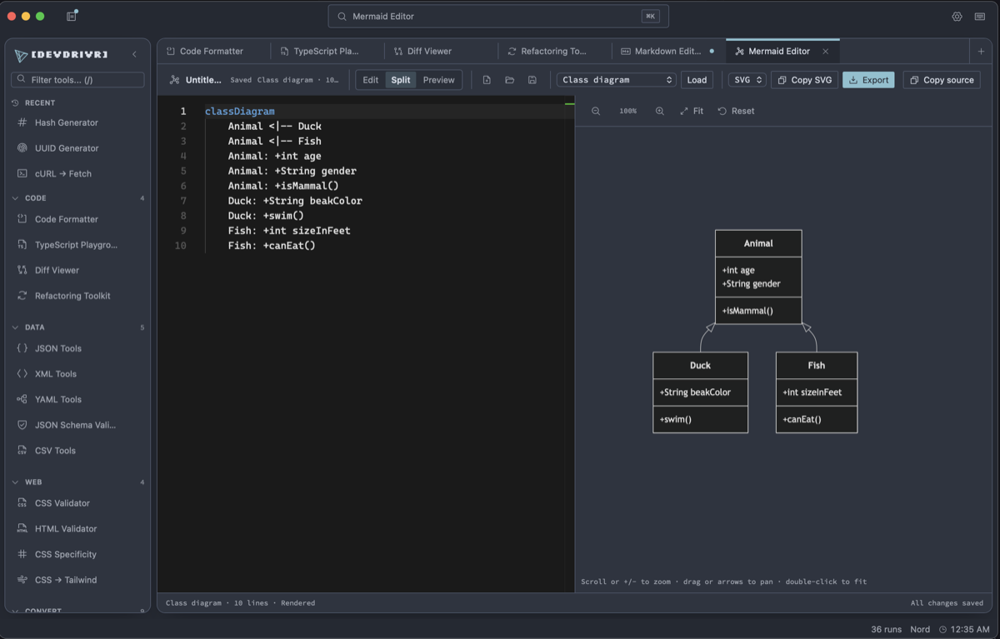
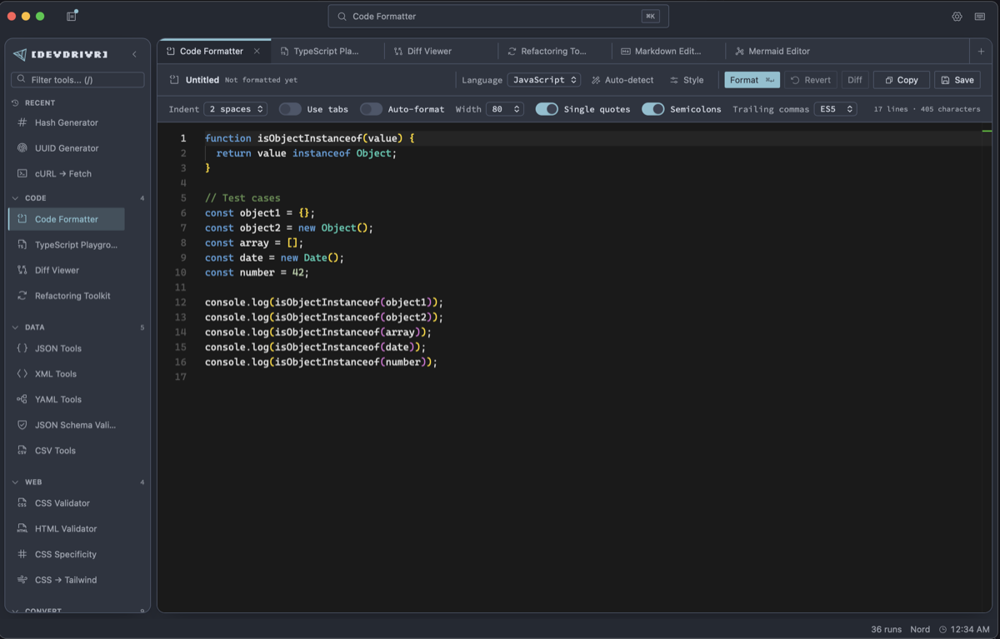
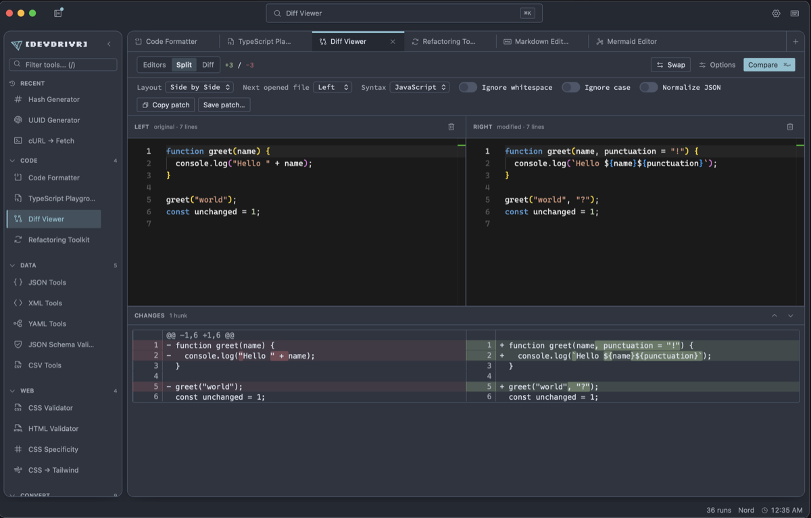
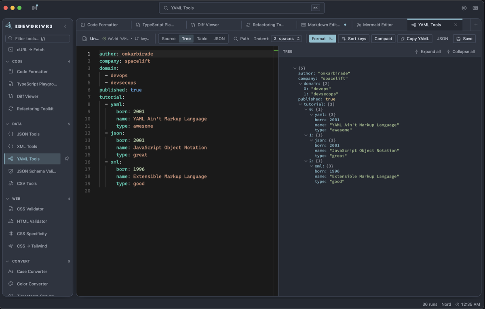
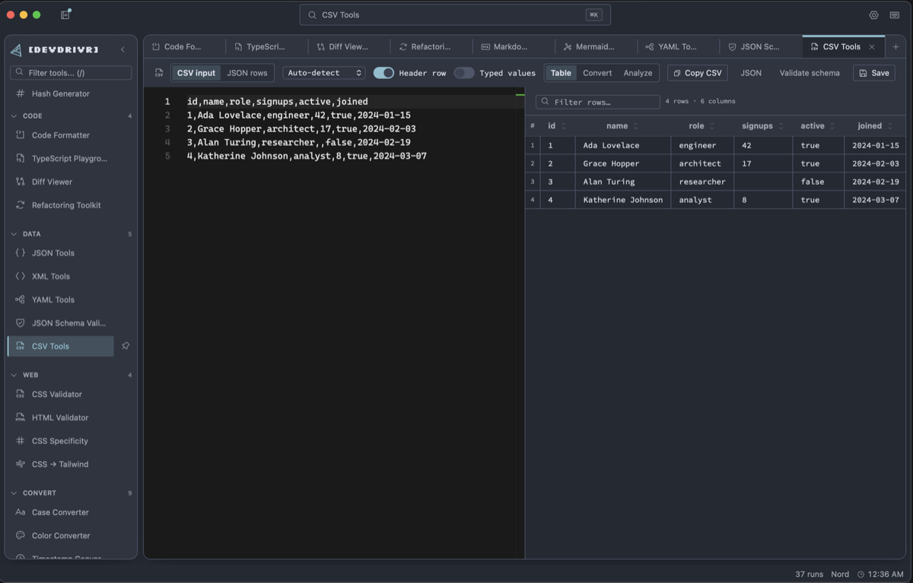
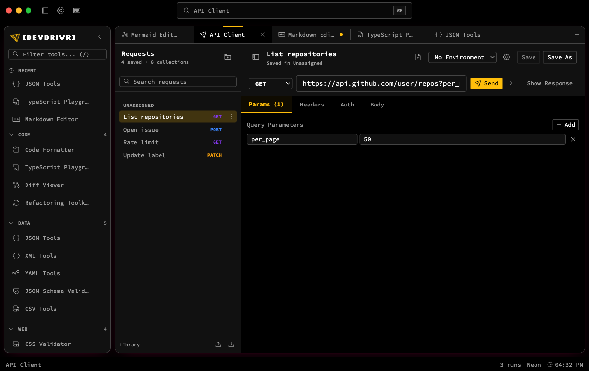
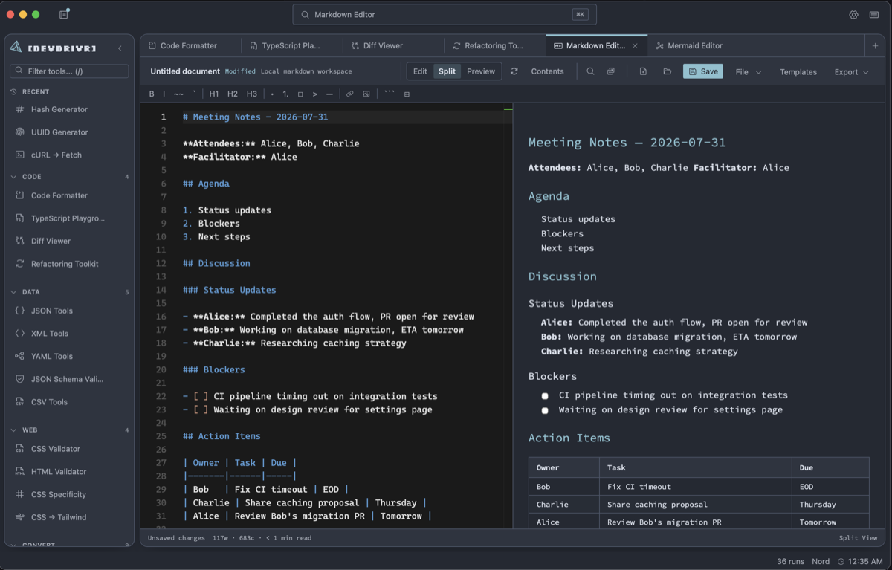

<div align="center">

# devdrivr

**30 developer tools. One desktop app. No browser, no cloud, no latency.**

[](https://github.com/butteredstardust/devdrivr/releases/latest)
[](https://github.com/butteredstardust/devdrivr/actions/workflows/cockpit-ci.yml)
[](LICENSE)
[](https://github.com/butteredstardust/devdrivr/releases/latest)

<br>



</div>

---

## What's inside

The **cockpit** app is the heart of devdrivr — a local-first, keyboard-driven developer workspace built with Tauri 2 + React 19. Everything runs on your machine. No accounts, no telemetry, no internet required.

| Group       | Tools                                                                                                           |
|-------------|----------------------------------------------------------------------------------------------------------------|
| **Code**    | Code Formatter · TypeScript Playground · Diff Viewer · Refactoring Toolkit                                     |
| **Data**    | JSON Tools · XML Tools · YAML Tools · JSON Schema Validator · CSV Tools                                        |
| **Web**     | CSS Validator · HTML Validator · CSS Specificity · CSS → Tailwind                                              |
| **Convert** | Case Converter · Color Converter · Timestamp Converter · Base64 · URL Encode/Decode · cURL → Fetch · UUID Generator · Hash · Image Tool |
| **Test**    | Regex Tester · JWT Decoder                                                                                     |
| **Network** | API Client · Docs Browser                                                                                      |
| **Write**   | Markdown Editor · Mermaid Editor · Snippets · Prompt Templates                                                 |

---

## Quick start

> [!NOTE]
> Prerequisites: [Bun](https://bun.sh) ≥ 1.0, [Rust](https://rustup.rs) stable, and [Tauri system dependencies](https://tauri.app/start/prerequisites/).

```bash
git clone https://github.com/butteredstardust/devdrivr
cd devdrivr/apps/cockpit
bun install
bun run tauri dev
```

See [`apps/cockpit/README.md`](apps/cockpit/README.md) for the full developer guide.

---

## Monorepo structure

This repo started from the [T4 Stack](https://github.com/timothymiller/t4-app) Turborepo template.
`apps/cockpit` is the only actively developed app; everything else is inherited scaffolding kept at
most dependency-patched. See [`AGENTS.md`](AGENTS.md) for the full per-app status breakdown.

```
apps/
  cockpit/    # Desktop — Tauri 2 + React 19 (active — this is devdrivr)
  next/       # Web — Next.js (legacy scaffold)
  tauri/      # Desktop — Tauri 1.4, wraps apps/next (legacy scaffold)
  expo/       # Mobile — Expo / React Native (legacy scaffold)
  docs/       # Documentation — Nextra (legacy scaffold)
  cli/        # create-t4-app scaffolder CLI (legacy scaffold)
  vscode/     # T4 App Tools VS Code extension (legacy scaffold)
packages/
  api/        # Backend — Hono + Drizzle + Cloudflare D1 (legacy scaffold)
  ui/         # Shared — Tamagui component library (legacy scaffold)
  app/        # Shared — cross-platform screens (legacy scaffold)
```

| App | Description |
|-----|-------------|
| [`apps/cockpit`](apps/cockpit) | **Active.** Desktop app — Tauri 2 + React 19. This is devdrivr. |
| [`apps/next`](apps/next) | Legacy — Web app, Next.js |
| [`apps/tauri`](apps/tauri) | Legacy — Tauri 1.4 shell wrapping `apps/next` |
| [`apps/expo`](apps/expo) | Legacy — Mobile app, Expo / React Native |
| [`packages/api`](packages/api) | Legacy — Backend, Hono on Cloudflare Workers + D1 |

```bash
bun run dev          # Start web + API dev servers
bun run desktop      # Start cockpit (Tauri)
bun run check-types  # Type-check all packages
bun run build:web    # Production web build
```

---

## Screenshots



**Format** — Prettier-backed formatting with indent, quote, semicolon, and trailing-comma controls.



**Compare** — Side-by-side and unified diffs, whitespace and case folding, patches you can copy or save.



**Data** — Inspect, validate, format, and convert structured data side by side.



**Tabular** — Read CSV as a sortable table, convert it to JSON, or validate it against a schema.



**Network** — Organize saved requests, environments, authentication, and responses.



**Write** — Work with Markdown, Mermaid diagrams, snippets, notes, and reusable prompts.

---

## License

MIT
