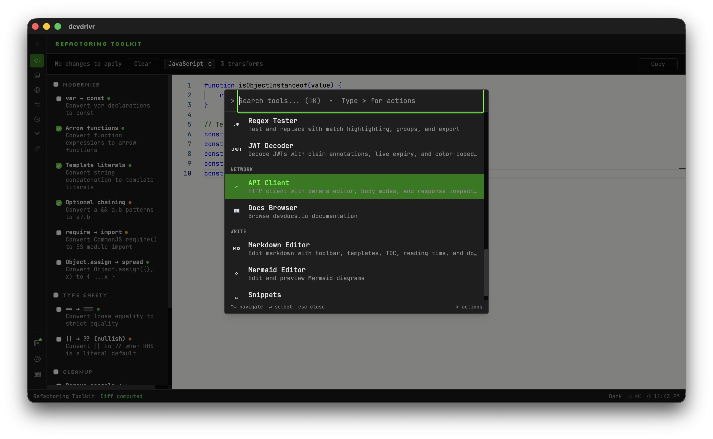

# devdrivr cockpit

A local-first, keyboard-driven developer utility workspace. 27 tools in a single Tauri desktop app — no browser, no cloud, no latency.



## Features

| Group     | Tools                                                                                     |
|-----------|-------------------------------------------------------------------------------------------|
| **Code**      | Code Formatter, TypeScript Playground, Diff Viewer, Refactoring Toolkit                      |
| **Data**      | JSON Tools, XML Tools, YAML Tools, JSON Schema Validator                                |
| **Web**       | CSS Validator, HTML Validator, CSS Specificity, CSS → Tailwind                            |
| **Convert**    | Case Converter, Color Converter, Timestamp Converter, Base64, URL Encode/Decode, cURL → Fetch, UUID Generator, Hash Generator |
| **Test**      | Regex Tester, JWT Decoder                                                                 |
| **Network**    | API Client, Docs Browser                                                                  |
| **Write**     | Markdown Editor, Mermaid Editor, Snippets Manager                                             |

### Shell Features

- **Command palette** — fuzzy search all tools (Cmd+K)
- **Notes drawer** — persistent notes with color tags and search
- **History** — per-tool input/output history
- **Snippets** — tagged code snippet library
- **Keyboard shortcuts** — full keyboard navigation (Cmd+/ for reference)
- **Themes** — dark / light / system
- **Always-on-top** — pin over other windows
- **Window state persistence** — remembers size and position

## Documentation

Comprehensive documentation is available in the [documentation](documentation/) directory:

- [API_COMPONENTS.md](documentation/API_COMPONENTS.md) - Complete API documentation for all components, hooks, and libraries
- [DEPLOYMENT.md](documentation/DEPLOYMENT.md) - Deployment and release process
- [ERROR_HANDLING.md](documentation/ERROR_HANDLING.md) - Error handling patterns and best practices
- [PERFORMANCE.md](documentation/PERFORMANCE.md) - Performance optimization guidelines
- [TESTING.md](documentation/TESTING.md) - Testing strategies and coverage
- [CONTRIBUTING.md](documentation/CONTRIBUTING.md) - Contribution guidelines
- [QUICK_START.md](documentation/QUICK_START.md) - Quick start guide for new users
- [USER_GUIDE.md](documentation/USER_GUIDE.md) - Comprehensive user guide
- [STYLE_GUIDE.md](documentation/STYLE_GUIDE.md) - Documentation style guidelines

## Tech Stack

| Layer         | Technology                              |
|---------------|----------------------------------------|
| Desktop shell | Tauri 2 (Rust + WebKit)               |
| UI            | React 19, TypeScript 5.9               |
| Styling       | Tailwind CSS 4, CSS custom properties   |
| State         | Zustand 5                              |
| Persistence    | SQLite via tauri-plugin-sql (WAL mode) |
| Build         | Vite 7                                 |
| Tests         | Vitest                                 |

## Prerequisites

- [Bun](https://bun.sh) `>= 1.0`
- [Rust](https://rustup.rs) stable toolchain
- Tauri system dependencies — see [tauri.app/start/prerequisites](https://tauri.app/start/prerequisites/)

## Development

```bash
cd apps/cockpit

# Install JS dependencies
bun install

# Start dev server (Vite + Tauri hot-reload)
bun run tauri dev

# Type-check
npx tsc --noEmit

# Run tests
bun run test

# Production build
bun run tauri build
```

## Project Structure

```text
apps/cockpit/
├── src/
│   ├── app/
│   │   ├── App.tsx               # Root layout (Sidebar + Workspace + Drawer + overlays)
│   │   ├── providers.tsx         # Bootstrap: stores, window geometry, theme
│   │   ├── tool-registry.ts      # All 27 tools (lazy imports + metadata)
│   │   └── tool-groups.tsx       # Sidebar group definitions with Phosphor icons
│   ├── components/
│   │   ├── shell/                # Layout chrome (Sidebar, Workspace, StatusBar, etc.)
│   │   └── shared/               # Reusable UI (Button, Toggle, Toast, TabBar, etc.)
│   ├── hooks/
│   │   ├── useGlobalShortcuts.ts # All keyboard shortcuts
│   │   └── useFileDropZone.ts    # Drag-and-drop file loading
│   ├── stores/
│   │   ├── settings.store.ts     # Theme, sidebar state, editor prefs
│   │   ├── notes.store.ts        # Notes CRUD
│   │   ├── snippets.store.ts     # Snippets CRUD
│   │   └── history.store.ts      # Per-tool history
│   ├── lib/
│   │   ├── db.ts                 # SQLite singleton + all query functions
│   │   └── theme.ts              # applyTheme() with localStorage cache
│   ├── tools/                    # One folder per tool
│   │   └── <tool-id>/<ToolName>.tsx
│   └── types/
│       ├── models.ts             # Note, Snippet, HistoryEntry, AppSettings
│       └── tools.ts              # ToolDefinition, ToolGroupMeta
├── src-tauri/
│   ├── src/lib.rs                # Tauri builder + plugin registration
│   ├── capabilities/default.json # IPC permissions
│   ├── migrations/001_initial.sql
│   └── tauri.conf.json
└── index.html                    # Inline theme cache script
```

## Adding a New Tool

1. Create `src/tools/<tool-id>/<ToolName>.tsx`
2. Add a lazy import in `src/app/tool-registry.ts`
3. Add an entry to `TOOLS` with `id`, `name`, `group`, `description`, `component`

Tool components receive no props — use `dispatchToolAction` / `useToolActionListener` for shell integration (file open, execute, copy output, tab switching).

## Keyboard Shortcuts

| Shortcut          | Action                            |
|-------------------|----------------------------------|
| Cmd+K            | Command palette                   |
| Cmd+B             | Toggle sidebar                    |
| Cmd+] / Cmd+[     | Next / previous tool               |
| Cmd+Shift+N       | Toggle notes drawer               |
| Cmd+Enter         | Execute / run                     |
| Cmd+Shift+C       | Copy output                       |
| Cmd+1 / 2 / 3    | Switch sub-tab                    |
| Cmd+O             | Open file                         |
| Cmd+S             | Save file                         |
| Cmd+,             | Settings                          |
| Cmd+Shift+T      | Toggle theme                       |
| Cmd+Shift+P      | Toggle always-on-top              |
| Cmd+/             | Keyboard shortcuts reference         |
