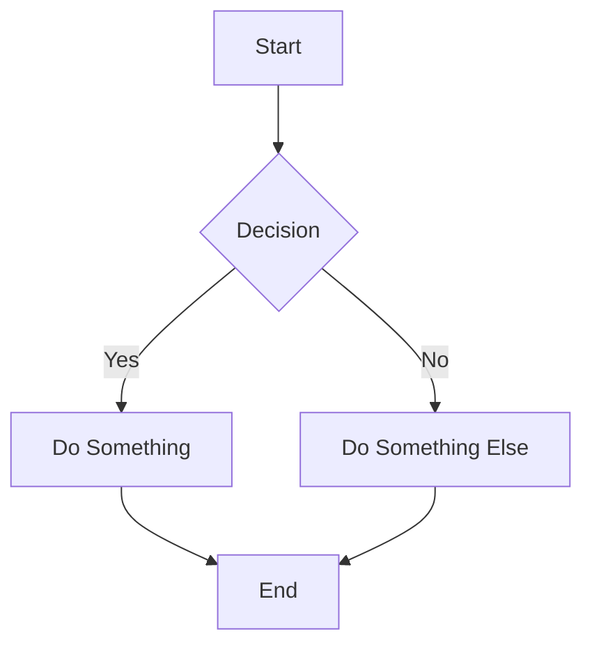

# Markdown Editor

## Overview

The Markdown Editor is a full-featured Markdown writing tool with live preview, toolbar shortcuts, and export capabilities. It supports GitHub Flavored Markdown (GFM) and includes special features for code blocks, tables, and diagrams.

## Features

### Editor

- **Split-pane view**: Edit on the left, preview on the right
- **Monaco Editor**: Full-featured code editor with Markdown syntax highlighting
- **Line numbers**: Toggle line numbers in the editor
- **Word wrap**: Automatic word wrapping for long lines
- **Auto-save**: Content is persisted as you type

### Toolbar

Quick access buttons for common Markdown elements:

- **Formatting**: Bold, Italic, Strikethrough
- **Headings**: H1, H2, H3, H4, H5, H6
- **Lists**: Bullet list, Numbered list, Task list
- **Code**: Inline code, Code block
- **Links & Images**: Insert link, Insert image
- **Tables**: Insert table
- **Horizontal rule**: Insert divider
- **Quote**: Blockquote

### Templates

Pre-built templates to start quickly:

- Blank document
- README.md
- Technical documentation
- Blog post
- Meeting notes
- Changelog

### GitHub Flavored Markdown (GFM)

Full GFM support including:

- **Tables**: Pipe-syntax tables with alignment
- **Task lists**: Checkbox lists (- [ ] / - [x])
- **Strikethrough**: ~~deleted text~~
- **Auto-linked URLs**: URLs are automatically clickable
- **Fenced code blocks**: Triple backticks with language hint
- **Syntax highlighting**: Code blocks with language-specific coloring

### Mermaid Diagrams

Insert Mermaid diagrams directly in Markdown:

- Flowcharts
- Sequence diagrams
- Class diagrams
- State diagrams
- Entity Relationship diagrams
- And more

Preview renders the Mermaid code as SVG diagrams.

### Reading Features

- **Table of Contents**: Auto-generated TOC from headings
- **Reading time**: Estimated reading time display
- **Word/character count**: Document statistics

### Export Options

- **Download as Markdown**: Save as `.md` file
- **Download as HTML**: Convert to standalone HTML file
- **Copy as HTML**: Copy rendered HTML to clipboard
- **Copy as Markdown**: Copy source to clipboard

## Usage

### Basic Editing

1. Start typing Markdown in the left pane
2. See the live preview on the right
3. Use toolbar buttons or keyboard shortcuts for formatting

### Inserting Code Blocks

1. Click the code button in toolbar or type triple backticks
2. Specify the language after the opening backticks
3. Enter your code
4. Close with triple backticks

Example:

<pre>
```javascript
function greet(name) {
  return `Hello, ${name}!`;
}
```
</pre>

### Inserting Tables

1. Click the table button in toolbar
2. Or write manually using pipe syntax:

```
| Column 1 | Column 2 | Column 3 |
| -------- | -------- | -------- |
| Cell 1   | Cell 2   | Cell 3   |
| Cell 4   | Cell 5   | Cell 6   |
```

### Inserting Mermaid Diagrams

1. Type triple backticks with "mermaid" as the language
2. Write Mermaid syntax inside
3. Preview renders the diagram

<pre>

</pre>

### Inserting Links and Images

- **Link**: `[link text](https://example.com)`
- **Image**: ``

Or use the toolbar buttons for a dialog-based insert.

## Keyboard Shortcuts

- **Cmd+B**: Bold
- **Cmd+I**: Italic
- **Cmd+K**: Insert link
- **Cmd+Shift+K**: Insert image
- **Cmd+`**: Inline code
- **Cmd+Enter**: Insert code block
- **Cmd+1-6**: Insert heading (1-6)
- **Cmd+L**: Bullet list
- **Cmd+Shift+L**: Numbered list
- **Cmd+Shift+T**: Insert table
- **Cmd+S**: Save / Download

## Technical Details

### State Management

The tool uses `useToolState` for persistent state:

- `content`: Markdown content
- `viewMode`: Editor only, preview only, or split
- `showLineNumbers`: Toggle line numbers
- `wordWrap`: Toggle word wrap
- `template`: Currently selected template

### Tool Integration

The Markdown Editor can receive content from other tools:

- Via the `send-to` action from other tools
- Drag and drop Markdown files

### Preview Rendering

The preview pane uses:

- `marked` for Markdown parsing
- `highlight.js` for code syntax highlighting
- `mermaid` for diagram rendering

## Dependencies

- Monaco Editor for the editing pane
- `marked` for Markdown parsing
- `highlight.js` for code syntax highlighting
- `mermaid` for diagram rendering
- Zustand for state management
- SQLite via `@tauri-apps/plugin-sql` for persistence

## Customization

The component follows the application theme system and uses CSS variables:

- `--color-bg`: Main background
- `--color-surface`: Panel backgrounds
- `--color-border`: Border colors
- `--color-text`: Text color
- `--color-accent`: Accent color for links and highlights
- `--color-code-bg`: Code block background
